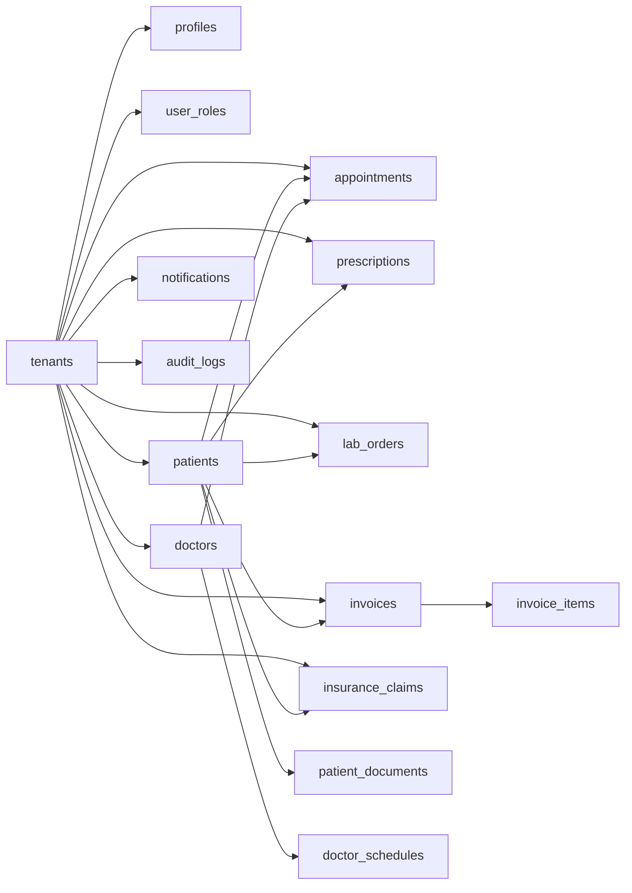

# Clinic Management System (Multi-tenant SaaS)

Production-grade clinic management system built with React, Vite, Supabase (Auth, Postgres, Storage), React Query, and Zustand. The codebase is organized into domain, services, repositories, and feature modules with tenant isolation enforced at the database and service layers.

## TL;DR

- Multi-tenant healthcare SaaS with strict tenant isolation at RLS + repository layers.
- Domain models validated via Zod; services enforce business rules and return standardized errors.
- Supabase RPCs handle sensitive or aggregate operations; edge functions cover public onboarding.
- Materialized views power reports; refresh is scheduled via pg_cron.
- Storage is tenant-scoped with private buckets and signed URL access.
- Rate limiting is enforced for auth and upload workflows.
- Production deployment targets Cloudflare Pages via GitHub Actions (build output: `dist`).

## Overview

Core capabilities:
- Multi-tenant clinics
- Patients, doctors, appointments, prescriptions, labs, billing, insurance
- Reporting with SQL-side aggregation
- Audit logging for critical actions
- Supabase RPCs for sensitive operations

## Feature Modules

### 1. Authentication & Security
Features:
- User authentication (login/logout/session handling)
- Password reset / account recovery
- Role-based access control (RBAC)
- Multi-tenant workspace isolation
- Audit logging for critical actions
Security controls:
- Tenant isolation
- Permission-based UI access
- Activity tracking via audit logs

### 2. Dashboard & System Overview
Features:
- Key performance indicators (KPIs)
- Recent activity feed
- Daily appointment overview
- Billing summary
- Lab and prescription alerts
Typical metrics:
- Today's appointments
- Active patients
- Pending lab results
- Outstanding invoices

### 3. Patient Management
Features:
- Patient profiles
- Medical history
- Status tracking
- Search and filtering
- Patient document management
Patient documents:
- Upload documents
- List stored files
- Delete documents
- Secure storage access

### 4. Doctor Management
Features:
- Doctor profiles
- Doctor status (active/inactive)
- Specialty tracking
- Doctor availability schedules
Scheduling:
- Weekly schedules
- Time slot management
- Schedule validation rules

### 5. Appointment Management
Features:
- List view
- Calendar view
- Create appointment
- Reschedule appointments
- Cancel appointments
- Status tracking
Workflow states:
- Scheduled
- Confirmed
- Completed
- Cancelled
- No-show

### 6. Prescription Management
Features:
- Create prescriptions
- View patient prescriptions
- Medication details
- Prescription history

### 7. Billing & Invoicing
Features:
- Invoice creation
- Billing summaries
- Payment tracking
- Invoice status management
Invoice states:
- Draft
- Pending
- Paid
- Cancelled

### 8. Pharmacy Inventory
Features:
- Medication catalog
- Stock tracking
- Inventory updates
- Pharmacy summary reports

### 9. Laboratory Management
Features:
- Create lab orders
- Track lab status
- Upload or record lab results
- Patient lab history
Lab states:
- Ordered
- In progress
- Completed
- Reviewed

### 10. Insurance Management
Features:
- Insurance claim records
- Claim status tracking
- Patient insurance linking
- Claim summary reports

### 11. Reports & Analytics
Features:
- Appointment analytics
- Revenue reports
- Patient growth metrics
- Status breakdowns
- Monthly and daily summaries
Exports:
- CSV export
- PDF reports where available

### 12. Notifications
Features:
- System notifications
- Status updates
- Important reminders
Examples:
- Appointment changes
- Lab result availability
- Invoice status updates

### 13. Settings & Administration
Features:
- Clinic profile settings
- User management
- Role and permission management
- Notification preferences
- Audit log viewer
- Tenant configuration

## Architecture

### Layering
- `domain`: Zod schemas + types. Pure validation and invariants.
- `services`: Business logic, validation, tenant resolution, error handling.
- `repositories`: All direct Supabase access (no Supabase in UI).
- `features`: UI modules + hooks.
- `core`: Auth, env validation, shared app infrastructure.

### Dependency Flow
```
features -> services -> repositories -> Supabase
features -> domain (types/schemas)
services -> domain (validation)
repositories -> Supabase client
```

### Tenant Context
- Tenant is derived from authenticated user context in services (`getTenantContext`).
- Repositories enforce tenant scoping in queries.
- RLS policies enforce tenant isolation in the database.

### Data Access Rules
- Supabase client is used only inside repositories.
- Services validate inputs and outputs with Zod.
- React Query keys are tenant-scoped via `src/services/queryKeys.ts`.

### Event System
- Lightweight domain event bus in `src/core/events`.
- Events emit from services and trigger handlers for audit logging, notifications, and analytics refresh.

### Background Jobs
- Job runner in `src/core/jobs` with retry and logging.
- Jobs execute via Supabase Edge Functions (admin-only).

### Feature Flags
- `feature_flags` table with tenant-scoped flags.
- `useFeatureAccess` combines plan entitlements + flags to control module visibility.

## Data Flow (High Level)

1. UI triggers service calls.
2. Services validate input with Zod, resolve tenant/user context.
3. Repositories execute tenant-scoped queries or RPCs.
4. Output is validated against domain schemas.
5. React Query caches data with tenant-scoped keys.

## Database & Schema Highlights

- Tenant isolation via `tenant_id` on all data tables.
- Exclusion constraints for preventing overlapping appointments and doctor schedules.
- Trigram indexes for fast ILIKE search.
- Report materialized views for aggregate KPIs.
- Audit logs for critical domain changes.

## Supabase Backend Surface

### Core Tables (High Level)
- `tenants`, `profiles`, `user_roles`, `subscriptions`
- `patients`, `patient_documents`, `medical_records`
- `doctors`, `doctor_schedules`
- `appointments`, `appointment_reminder_log`
- `prescriptions`, `medications`
- `lab_orders`
- `invoices`, `invoice_items`
- `insurance_claims`
- `notifications`, `notification_preferences`
- `audit_logs`, `client_error_logs`
- `feature_flags`
- `rate_limits`

### RPC Functions (Selected)
- `check_rate_limit`
- `log_audit_event`
- `get_report_overview`, `get_report_revenue_by_month`, `get_report_patient_growth`
- `get_report_appointment_types`, `get_report_appointment_statuses`
- `get_report_revenue_by_service`, `get_report_doctor_performance`
- `get_invoice_summary`, `get_medication_summary`, `get_insurance_summary`
- `generate_patient_code`
- `search_global`

### Edge Functions
- `register-clinic` (public onboarding with CAPTCHA + rate limiting)
- `check-slug` (public slug availability with CAPTCHA + rate limiting)
- `invite-staff` (authenticated, admin-only)
- `appointment-reminders` (cron-invoked, emails + in-app notifications)
- `send-appointment-notifications` (admin-only job trigger)
- `generate-monthly-reports` (admin-only job trigger)
- `refresh-materialized-views` (admin-only job trigger)
- `process-insurance-claims` (admin-only job trigger)
- `send-invoice-emails` (admin-only job trigger)

### Storage Buckets
- `avatars` (private, image-only)
- `patient-documents` (private, tenant-scoped)

## Security Model

- RLS enabled across all multi-tenant tables.
- RBAC enforced at RLS + service layer.
- Storage buckets private; access via signed URLs.
- Edge functions hardened with CAPTCHA, rate limiting, and email verification.
- Service role keys used only in server-side functions.
- Rate limiting enforced via `check_rate_limit` for login, password reset, and upload flows.
- Soft deletes enforced by repository filters and restrictive RLS policies.

## Performance & Scalability

- Server-side pagination for large lists.
- Typeahead search with limits and server-side filtering.
- Materialized views for reports (scheduled refresh).
- Tenant-scoped React Query keys to avoid cache bleeding.
- Realtime invalidation targets specific query keys.

## Observability

- Client error logs stored in `client_error_logs` (tenant-scoped).
- Audit logs for critical actions (patients, appointments, invoices, documents, lab orders, prescriptions, insurance).
- Audit and error logs include `request_id`, `action_type`, and `resource_type` for tracing.

## Error Handling

- Services throw standardized errors (`ServiceError`, `ValidationError`, `AuthorizationError`, `NotFoundError`, `ConflictError`, `BusinessRuleError`).
- Repositories map Supabase errors to service errors consistently.

## Environment & Configuration

Environment validation is enforced at startup in `src/core/env/env.ts`.

Required variables:
- `VITE_SUPABASE_URL`
- `VITE_SUPABASE_PUBLISHABLE_KEY`

Optional variables:
- `VITE_SUPABASE_PROJECT_ID`
- `VITE_CAPTCHA_SITE_KEY`
- `VITE_SENTRY_DSN`

Templates:
- `.env.example` (remote)
- `.env.local.example` (local)

## Local Development Quick Start

1. Install dependencies:
```
npm install
```

2. Start Supabase locally:
```
supabase start
```

3. Use local environment:
```
npm run env:local
```

4. Start the app:
```
npm run dev
```

## Remote Development

1. Ensure `.env` points to the remote project.
2. Use remote environment:
```
npm run env:remote
```

## Environment Switching

We use `.env` for remote and `.env.local` for local.

Commands:
```
npm run env:local
npm run env:remote
npm run env:status
```

## Supabase Workflows

Apply migrations locally:
```
supabase migration up
```

Reset local DB:
```
supabase db reset
```

Push migrations to remote:
```
supabase db push
```

Run DB tests (pgTAP):
```
supabase test db
```

## Testing

- Unit tests: `npm run test`
- End-to-end tests: `npm run test:e2e`
- Database policy + RPC tests: `supabase test db`
- Build validation: `npm run build`

### E2E Environment

The Playwright suite will auto-start a local Vite server on `http://127.0.0.1:4173` unless `E2E_BASE_URL` is provided.

Required environment variables for the super-admin coverage:
- `E2E_SUPER_ADMIN_EMAIL`
- `E2E_SUPER_ADMIN_PASSWORD`
- `E2E_ADMIN_EMAIL`
- `E2E_ADMIN_PASSWORD`
- `E2E_CLINIC_SLUG`

Optional helpers:
- `E2E_DOCTOR_NAME`
- `E2E_PORTAL_EMAIL`
- `E2E_PORTAL_PASSWORD`

Run only the super-admin SaaS coverage:
```
npx playwright test tests/e2e/super-admin-pricing.spec.ts tests/e2e/super-admin-tenant-lifecycle.spec.ts tests/e2e/super-admin-module-gating.spec.ts
```

## CI/CD

GitHub Actions workflows:
- `ci.yml`: lint, unit tests, coverage gate.
- `migrations.yml`: apply migrations to remote with approval.
- `backup-verify.yml`: backup verification checks.
- `cloudflare-deploy.yml`: deploy to Cloudflare Pages on `main`.

## Scripts

- `npm run dev` - start Vite
- `npm run build` - build for production
- `npm run lint` - lint
- `npm run test` - unit tests
- `npm run test:db` - Supabase db tests
- `npm run env:local` - switch to local env
- `npm run env:remote` - switch to remote env
- `npm run env:status` - check which env is active

## Project Structure

```
src/
  app/         App wiring and routes
  core/        Cross-cutting concerns (auth, env, config)
  domain/      Zod schemas + types
  services/    Service layer + repositories
  features/    Feature modules (UI + hooks)
  shared/      Shared UI + utilities
```

## Security Notes

- Client uses publishable key only.
- Service role key must never be used on the frontend.
- RLS is enabled across all multi-tenant tables.
- Storage buckets are private; sensitive assets use signed URLs.

## Documentation

- Local vs remote usage: `docs/local-and-remote-supabase.md`
- RLS review: `docs/rls-policy-review-2026-03-11.md`
- Production hardening: `docs/production-hardening.md`

## Deployment

This repo deploys to Cloudflare Pages.

Requirements:
- Cloudflare Pages project created for the repo.
- GitHub Actions secrets:
  - `CLOUDFLARE_API_TOKEN`
  - `CLOUDFLARE_ACCOUNT_ID`
  - `CLOUDFLARE_PAGES_PROJECT_NAME`

Cloudflare Pages environment variables (set in the dashboard for Production and Preview):
- `VITE_SUPABASE_URL`
- `VITE_SUPABASE_PUBLISHABLE_KEY`
- `VITE_SUPABASE_PROJECT_ID` (optional)
- `VITE_CAPTCHA_SITE_KEY` (optional)
- `VITE_SENTRY_DSN` (optional)

Before production:
- `npm run build`
- `supabase db diff` against production
- `supabase db push` to production
- Run smoke tests

## Architecture and Risk Analysis

### Strengths
- Clear domain/service/repository separation.
- Tenant isolation enforced at multiple layers.
- Zod validation at service boundaries.
- RLS + audit logging for critical data.
- Report aggregates via materialized views.

### Remaining Considerations
- Materialized view refresh schedule should match business requirements for reporting freshness.
- Realtime invalidation is optimized but still domain-level; record-level invalidation could further reduce refetch.
- Large patient histories are now paginated; UI should expose pagination controls where needed.
- Soft delete columns are referenced in services; ensure migrations exist in every environment.
- If additional public endpoints are added, they must include CAPTCHA and rate limiting.

### Security Posture Summary
- RLS coverage expanded and tested.
- Storage policies enforce tenant isolation.
- Edge functions hardened with CAPTCHA, rate limits, and email verification.

## Roadmap (Planned Enhancements)

- Advanced job orchestration (queue-based execution) as load grows.
- Automated incident alerts and SLO dashboards.

## Contributing

1. Create a branch
2. Add migrations for schema changes (never edit applied migrations)
3. Run `supabase test db`
4. Open a PR

---

## Data Model Diagram (High-Level)



Notes:
- All core entities are tenant-scoped by `tenant_id`.
- Soft delete columns are used in core entities (`deleted_at`, `deleted_by`).
- Audit logs capture critical domain actions.

---

## API Examples

### Services (Frontend)

```ts
import { patientService } from "@/services";

// Create a patient
const created = await patientService.create({
  full_name: "Maya Hassan",
  date_of_birth: "1991-04-12",
  gender: "female",
  phone: "+20 100 555 1122",
});

// List patients with pagination
const page = await patientService.list({ search: "maya", limit: 20, offset: 0 });
```

```ts
import { appointmentService } from "@/services";

// Create appointment with conflict protection
await appointmentService.create({
  patient_id: "uuid",
  doctor_id: "uuid",
  appointment_date: "2026-03-13T10:00:00.000Z",
  duration_minutes: 30,
  type: "consultation",
});
```

```ts
import { reportService } from "@/services";

// Aggregated dashboards (RPC-backed)
const overview = await reportService.getOverview();
const revenueByMonth = await reportService.getRevenueByMonth(6);
```

### RPC (Database)

```sql
-- Get reporting overview
select * from public.get_report_overview();

-- Apply tenant-safe global search (limit results)
select * from public.search_global('maya', 8);
```

### Edge Functions

```bash
# Check slug availability (public, CAPTCHA required)
curl -X POST "$SUPABASE_URL/functions/v1/check-slug" \
  -H "Content-Type: application/json" \
  -d '{"clinicName":"Bright Clinic","captchaToken":"..."}'

# Register clinic (public, CAPTCHA + rate limiting)
curl -X POST "$SUPABASE_URL/functions/v1/register-clinic" \
  -H "Content-Type: application/json" \
  -d '{"clinicName":"Bright Clinic","fullName":"Maya Hassan","email":"maya@example.com","password":"strong-pass","captchaToken":"..."}'
```

---

## Ops Runbooks

### Local Development

1. Start Supabase locally:
```
supabase start
```
2. Apply migrations:
```
supabase migration up
```
3. Run DB tests:
```
supabase test db
```

### Remote Deploy (Supabase)

1. Ensure `.env` points to remote project:
```
npm run env:remote
```
2. Apply migrations to remote:
```
supabase db push
```
3. Validate policies and RPCs:
```
supabase test db
```

### Cloudflare Pages Deploy

1. Push to `main` to trigger `.github/workflows/cloudflare-deploy.yml`.
2. Confirm build output `dist` is deployed.
3. For preview builds, ensure the same env vars exist under Preview environment.

### Backup & Restore

- Backup: use Supabase dashboard backups or `pg_dump` from a managed replica.
- Restore: create a new project, restore snapshot, re-apply secrets, then repoint `.env`.

### Incident Response (Data Leakage or Policy Regression)

1. Freeze writes by revoking write policies or setting tenant feature flags to disable modules.
2. Rotate keys:
   - Rotate JWT secrets and service role keys.
   - Regenerate signed URL policies if used.
3. Run audit log review by tenant and time window.
4. Patch and re-run `supabase test db`.

### Edge Functions Operations

- Deploy: `supabase functions deploy <name>`
- Secrets: `supabase secrets set KEY=VALUE`
- Verify JWT: set `verify_jwt = true` in `supabase/config.toml` for protected functions.
