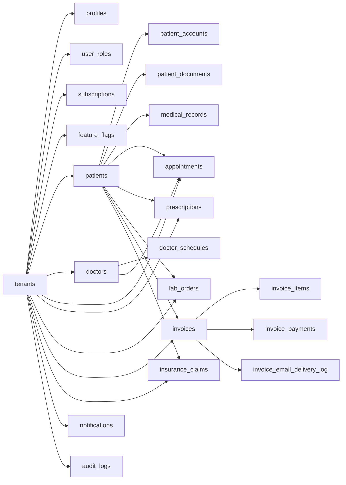

# Shefaa Clinic Platform

Shefaa is a production-oriented, multi-tenant clinic SaaS for running outpatient clinic operations across Arabic and English workspaces. It combines a React/Vite frontend, Supabase Auth/Postgres/Storage/Edge Functions, strict tenant isolation, role-based access, patient-facing portal flows, billing operations, telemedicine foundations, and audit-ready service boundaries.

The system is built as a real healthcare operations app, not a demo shell: direct database access is kept behind repositories, business workflows run through services and domain schemas, sensitive flows are protected by RLS/RBAC/MFA-style controls, and operational jobs are handled through Supabase Edge Functions.

## System Snapshot

- Multi-tenant clinic workspace with tenant-scoped data, RLS policies, service-layer checks, and tenant-aware React Query keys.
- Core clinic operations: dashboard, patients, doctors, appointments, prescriptions, laboratory, pharmacy inventory, insurance, billing, reports, notifications, settings, and audit logs.
- Patient portal under `/portal/:clinicSlug` with invite-aware magic-link login and patient-scoped views for appointments, prescriptions, lab results, documents, and invoices.
- Admin console under `/admin` for platform administration, tenant lifecycle, pricing, subscriptions, feature/module gating, jobs, and impersonation controls.
- Privileged access hardening for elevated users, including TOTP/session verification surfaces and scoped step-up grants for sensitive actions.
- Bilingual Arabic/English frontend using i18next, ICU formatting, lazy namespaces, tenant/user-scoped language persistence, and RTL document metadata.
- Supabase Edge Functions for onboarding, staff invites, reminders, invoice emails, jobs, Agora token issuance, lab webhooks, and integration API entry points.
- Deployment target: Cloudflare Pages for the frontend, Supabase for database, auth, storage, functions, and scheduled/backend work.

## Product Areas

### Clinic Workspace

Clinic users work inside `/tenant/:clinicSlug` after authentication. Route access is permission-gated and, where applicable, subscription/module-gated.

- Dashboard KPIs and activity overview.
- Patient records, medical history, document upload/list/delete, imports, archive/restore, and duplicate checks.
- Doctor profiles and weekly schedule management.
- Appointment list/calendar workflows with conflict detection and telemedicine entry points.
- Prescriptions, lab orders/results, pharmacy inventory, insurance claims, billing/invoices/payments, reports, search, notifications, and clinic settings.

### Patient Portal

Patients enter through `/portal/:clinicSlug/login` and access only their own scoped account data after portal authentication.

- Portal dashboard.
- Appointments.
- Prescriptions.
- Lab results.
- Documents.
- Invoices.

Portal auth and scope tests live in `tests/e2e/portal-auth.spec.ts`.

### Platform Admin

Super-admin functionality lives under `/admin` and uses privileged route protection.

- Tenant and module administration.
- Pricing/subscription management.
- Job visibility and retries.
- Admin impersonation workflows.
- Privileged security setup under `/security/privileged`.

### Communications and Jobs

The backend includes job and notification infrastructure rather than relying only on frontend side effects.

- Appointment reminders via `appointment-reminders`.
- Invoice email execution via `send-invoice-emails` and durable `invoice_email_delivery_log` records.
- Admin-triggered jobs for appointment notifications, insurance processing, monthly reports, and materialized-view refresh.
- Integration entry points for lab webhooks and partner API workflows.

## Architecture

### Frontend Stack

- React 18 + Vite.
- TypeScript.
- React Router.
- TanStack Query.
- Zustand.
- Tailwind CSS + shadcn/Radix primitives.
- i18next + react-i18next + ICU.
- Recharts, jsPDF, Playwright, Vitest, ESLint.

### Backend Stack

- Supabase Auth.
- Supabase Postgres with RLS, RPCs, triggers, indexes, constraints, and materialized views.
- Supabase Storage with private buckets and signed URL access.
- Supabase Edge Functions for server-side workflows.
- pgTAP database tests under `supabase/tests`.

### Code Boundaries

The main dependency flow is:

```text
features -> services -> repositories -> Supabase
features -> domain
services -> domain
```

Key directories:

```text
src/
  app/              app wiring
  core/             auth, env, i18n, jobs, subscription, shared infrastructure
  domain/           Zod schemas and domain types
  features/         route-level feature modules and UI workflows
  services/         business services, repositories, query keys, realtime, jobs
  shared/           shared UI, utilities, cross-feature components
  components/       design-system and shadcn-style primitives

supabase/
  migrations/       schema, RLS, RPC, trigger, index, and hardening migrations
  functions/        Supabase Edge Functions
  tests/            pgTAP database tests

tests/
  e2e/              Playwright coverage and helpers
```

### Service Boundary Rules

- UI code calls services and hooks, not Supabase tables directly.
- Repositories own direct Supabase access.
- Services resolve tenant/user context, apply business rules, and map errors.
- Domain schemas validate inputs and outputs.
- Query keys are centralized in `src/services/queryKeys.ts` and must remain tenant-safe.

## Internationalization

Shefaa has an enterprise-grade bilingual frontend foundation:

- English and Arabic resources.
- RTL support via `document.documentElement.dir` and `lang` synchronization.
- Lazy namespace loading per route.
- ICU plural/date/number formatting.
- Tenant/user-scoped language persistence using keys such as `lang:${tenantId}:${userId}`.
- Shared `useI18n`, `translatePath`, and formatting utilities under `src/core/i18n`.

The current rollout is intentionally incremental by module so localization remains UI-only and does not leak into service or database boundaries.

## Security Model

Security is enforced across the frontend, service layer, database, and functions:

- Supabase Auth for sessions and identity.
- Role and permission checks in protected routes and services.
- RLS enabled on multi-tenant tables.
- Tenant-scoped repository queries and RPC calls.
- Private storage buckets for patient documents and avatars.
- Signed URL access for sensitive files.
- CAPTCHA and rate limiting on public onboarding paths.
- Service role usage limited to server-side Edge Functions and scripts.
- Audit logging for sensitive domain actions.
- Privileged admin flows protected by MFA/session verification and server-issued step-up grants.

Important security-oriented tests include:

- `supabase/tests/admin_super_admin_hardening.sql`
- `tests/e2e/privileged-security.spec.ts`
- portal scope checks in `tests/e2e/portal-auth.spec.ts`

## Supabase Surface

### Selected Tables

- Platform and access: `tenants`, `profiles`, `user_roles`, `user_global_roles`, `subscriptions`, `feature_flags`
- Clinic operations: `patients`, `medical_records`, `patient_documents`, `doctors`, `doctor_schedules`, `appointments`
- Clinical and finance: `prescriptions`, `medications`, `lab_orders`, `invoices`, `invoice_items`, `invoice_payments`, `insurance_claims`
- Portal and communication: `patient_accounts`, `notifications`, `notification_preferences`, `appointment_reminder_log`, `invoice_email_delivery_log`
- Operations and audit: `audit_logs`, `client_error_logs`, `rate_limits`, `jobs`, `command_idempotency`, `privileged_step_up_grants`

### Selected RPCs

- `check_rate_limit`
- `log_audit_event`
- `search_global`
- `generate_patient_code`
- `get_portal_login_metadata`
- `get_report_overview`
- `get_report_revenue_by_month`
- `get_report_patient_growth`
- `get_invoice_summary`
- `post_invoice_payment`
- `issue_privileged_step_up_grant`
- `consume_privileged_step_up_grant_for_actor`

### Edge Functions

- `register-clinic` - public clinic onboarding with CAPTCHA/rate limiting.
- `check-slug` - public clinic slug availability with CAPTCHA/rate limiting.
- `invite-staff` - protected staff invitation flow.
- `appointment-reminders` - scheduled reminders and notification delivery.
- `send-appointment-notifications` - admin/job-triggered appointment notifications.
- `send-invoice-emails` - invoice email delivery with durable delivery logs.
- `generate-monthly-reports` - report generation job.
- `refresh-materialized-views` - report aggregate refresh job.
- `process-insurance-claims` - insurance workflow job.
- `job-worker` - background job execution.
- `agora-token` - telemedicine token issuance.
- `lab-webhook-inbound` - inbound lab integration endpoint.
- `integration-api` - partner/integration API surface.

### Storage Buckets

- `avatars` - private user/clinic images.
- `patient-documents` - private tenant-scoped patient files.

## Local Setup

### Prerequisites

- Node.js compatible with the lockfile.
- npm 10.x.
- Supabase CLI.
- Docker Desktop if running local Supabase.

### Install

```bash
npm install
```

### Environment

Frontend startup validates required Vite variables in `src/core/env/env.ts`.

Required:

```text
VITE_SUPABASE_URL=
VITE_SUPABASE_PUBLISHABLE_KEY=
```

Common optional values:

```text
VITE_SUPABASE_PROJECT_ID=
VITE_CAPTCHA_SITE_KEY=
VITE_SENTRY_DSN=
VITE_APP_VERSION=
APP_ORIGINS=
REMINDER_CRON_SECRET=
SENTRY_DSN=
```

Templates:

- `.env.example` for remote/default configuration.
- `.env.local.example` for local Supabase values.
- `.env.e2e.local` is generated by the E2E bootstrap when possible.

This checkout currently defaults to remote env behavior. `npm run env:remote` disables `.env.local` if it exists, and `npm run env:status` reports which env file mode is active. Local Supabase can still be used manually by creating `.env.local` from `.env.local.example` and matching the values from `supabase status`.

### Run the App

```bash
npm run dev
```

Build and preview:

```bash
npm run build
npm run preview
```

## Supabase Workflows

Start local Supabase:

```bash
supabase start
```

Apply local migrations:

```bash
supabase migration up
```

Reset local database:

```bash
supabase db reset
```

Create a schema diff:

```bash
supabase db diff
```

Push migrations to a linked remote project:

```bash
supabase db push
```

Run database tests:

```bash
supabase test db
```

## Scripts

| Command | Purpose |
| --- | --- |
| `npm run dev` | Start the Vite dev server. |
| `npm run build` | Production build to `dist`. |
| `npm run build:dev` | Development-mode Vite build. |
| `npm run preview` | Preview the built app locally. |
| `npm run lint` | Run ESLint. |
| `npm run test` | Run Vitest unit/integration tests. |
| `npm run test:watch` | Run Vitest in watch mode. |
| `npm run test:coverage` | Run Vitest with coverage. |
| `npm run test:db` | Run Supabase pgTAP database tests. |
| `npm run test:db:remote` | Run the remote DB test helper. |
| `npm run e2e:bootstrap` | Seed/bootstrap deterministic E2E users and env. |
| `npm run test:e2e` | Run Playwright E2E tests. |
| `npm run test:load` | Run the load-test helper. |
| `npm run env:remote` | Disable `.env.local` and use remote/default env. |
| `npm run env:status` | Report active env mode. |
| `npm run health:outbound` | Check outbound/provider health. |

## Testing

Recommended validation before opening a PR:

```bash
npm run lint
npm run test
npm run build
```

Database/security validation:

```bash
supabase test db
```

End-to-end validation:

```bash
npm run test:e2e
```

The Playwright config starts a preview server on `http://127.0.0.1:4173` unless `E2E_BASE_URL` is supplied. The bootstrap script can create deterministic admin, super-admin, doctor, and portal fixtures and writes `.env.e2e.local` for the test run.

Common E2E variables:

```text
E2E_SUPER_ADMIN_EMAIL=
E2E_SUPER_ADMIN_PASSWORD=
E2E_ADMIN_EMAIL=
E2E_ADMIN_PASSWORD=
E2E_CLINIC_SLUG=
E2E_DOCTOR_NAME=
E2E_PORTAL_EMAIL=
E2E_PORTAL_PASSWORD=
```

Targeted examples:

```bash
npx playwright test tests/e2e/privileged-security.spec.ts
npx playwright test tests/e2e/portal-auth.spec.ts
```

## Deployment

The frontend deploys to Cloudflare Pages with build output in `dist`.

Required Cloudflare/GitHub secrets:

```text
CLOUDFLARE_API_TOKEN
CLOUDFLARE_ACCOUNT_ID
CLOUDFLARE_PAGES_PROJECT_NAME
```

Cloudflare Pages environment variables:

```text
VITE_SUPABASE_URL
VITE_SUPABASE_PUBLISHABLE_KEY
VITE_SUPABASE_PROJECT_ID
VITE_CAPTCHA_SITE_KEY
VITE_SENTRY_DSN
VITE_APP_VERSION
```

Supabase Edge Function secrets vary by function. Common production values include:

```text
APP_ORIGINS
SUPABASE_URL
SUPABASE_SERVICE_ROLE_KEY
SUPABASE_PUBLISHABLE_KEY
REMINDER_CRON_SECRET
RESEND_API_KEY
INVOICE_EMAIL_FROM
AGORA_APP_ID
AGORA_APP_CERTIFICATE
HCAPTCHA_SECRET
SENTRY_DSN
```

Pre-deploy checklist:

```bash
npm run lint
npm run test
npm run build
supabase db diff
supabase test db
```

Then apply migrations through the approved Supabase deployment workflow and verify Cloudflare Pages preview/production environment variables.

## CI/CD

GitHub Actions workflows are kept under `.github/workflows`.

- CI: lint, tests, and build/coverage checks.
- Migration workflows: controlled Supabase migration application.
- Backup verification: operational backup smoke checks.
- Cloudflare Pages deployment: frontend deployment from `main`.

## Documentation

Useful project docs:

- `docs/clinic-workflow.md` - current clinic workflow and business rules.
- `docs/feature-production-readiness-report.md` - feature maturity and risk overview.
- `docs/production-readiness-roadmap.md` - hardening roadmap.
- `docs/production-hardening.md` - production security notes.
- `docs/local-and-remote-supabase.md` - local/remote Supabase workflows.
- `docs/rls-policy-review-2026-03-11.md` - RLS review.
- `docs/ops/backup-and-restore.md` - backup/restore runbook.
- `docs/ops/incident-response-and-access-review.md` - incident and access review runbook.
- `docs/ops/phi-retention-and-deletion.md` - PHI lifecycle policy notes.
- `docs/ops/vendor-compliance-inventory.md` - vendor/compliance inventory.

## Data Model Overview



All core clinic records are tenant-scoped. Sensitive operations are designed to be validated in services and enforced again by RLS, RPCs, constraints, or Edge Function authorization.

## Contributing

1. Create a branch.
2. Keep changes inside the existing domain/service/repository boundaries.
3. Add migrations for schema changes; do not edit applied migrations.
4. Add focused tests for changed behavior.
5. Run lint, tests, build, and relevant Supabase tests.
6. Open a PR with verification notes and any remaining operational risk.
